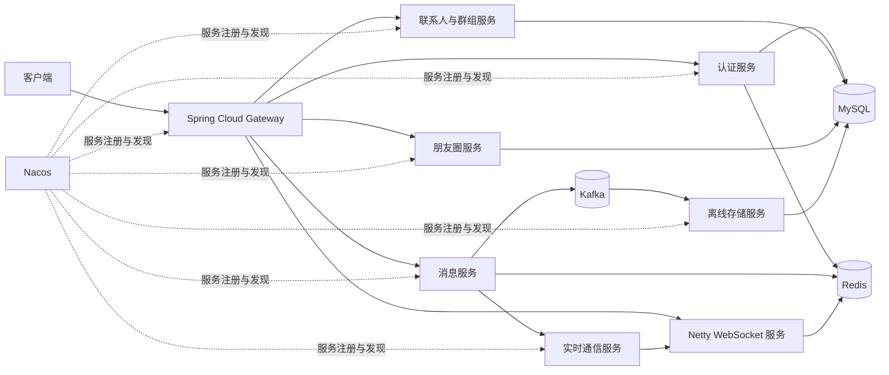
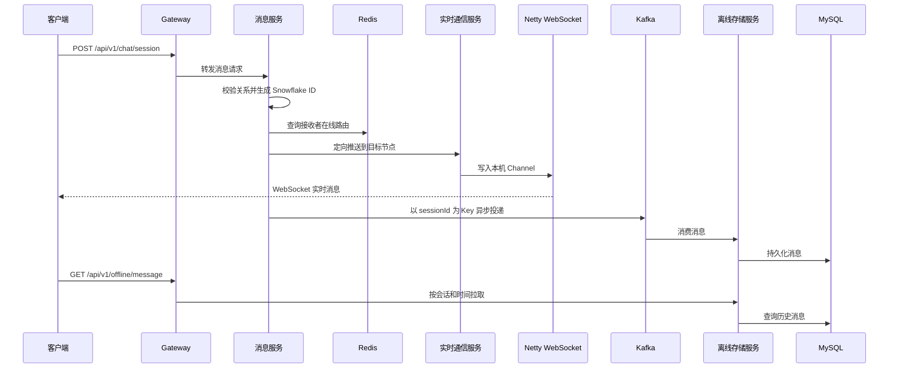

# InfiniteChat - Instant Messaging

> 面向高并发场景的分布式即时通讯后端。项目以 WebSocket 长连接承载实时消息，以 Kafka 解耦消息持久化，并围绕连接路由、会话顺序、离线补拉与红包并发控制构建可靠的消息链路。

## 项目亮点

- **双通道消息链路**：Netty + WebSocket 负责在线实时推送；Kafka 负责异步持久化和离线消息补拉，降低主链路的数据库写入压力。
- **可靠长连接**：提供 JWT 身份识别、心跳保活、ACK 确认、超时重传和异常断线清理机制，保障消息可靠投递。
- **动态连接路由**：通过 Redis 维护用户在线节点映射，并结合一致性哈希路由实现分布式环境下的用户连接精准定位，降低节点扩缩容带来的重连影响。
- **会话有序投递**：以单聊会话或群会话维度设计 Kafka 分区与顺序消费策略，保障同一会话内消息顺序。
- **高并发红包**：使用 Redis Lua 脚本原子预占库存和领取状态；结合数据库行锁、事务、状态机、补偿与定时对账，处理双数据源最终一致性及过期退款。
- **全局唯一 ID**：使用 Snowflake 算法生成消息、红包等业务主键，满足分布式部署下的全局唯一性需求。

## 技术栈

| 分类 | 技术 |
| --- | --- |
| 基础框架 | Java 8, Spring Boot 2.6.13, Maven |
| 微服务 | Spring Cloud Alibaba, Spring Cloud Gateway, OpenFeign, Nacos |
| 实时通信 | Netty, WebSocket |
| 消息与存储 | Kafka, MySQL 8, MyBatis-Plus, Redis |
| 安全与文件 | JWT, MinIO, 阿里云短信服务 |
| 工具与部署 | Docker / Docker Compose, Lombok, Hutool, OkHttp |

## 架构概览



### 消息主链路



## 核心能力

### 1. 账号、好友与群组

- 短信验证码注册、密码登录、验证码登录和 JWT 凭证签发。
- 头像上传地址生成及头像更新，文件对象可由 MinIO 托管。
- 用户搜索、好友申请与处理、删除好友、拉黑好友。
- 群聊创建、邀请成员、踢出成员、退出群聊和群成员查询。

### 2. 实时通信与可靠投递

- Netty 承载 WebSocket 长连接，支持握手鉴权、心跳、ACK、登出和断线清理。
- 节点内以双向 `ConcurrentHashMap` 维护 `userId <-> Channel` 关系；Redis 保存在线节点路由信息。
- 消息服务通过动态路由定位实时通信节点并进行定向推送；群消息按成员分布完成跨节点投递。
- ACK 确认、超时重传和客户端离线补拉共同组成可靠投递闭环。

### 3. 异步持久化与会话顺序

- 消息发送后同步走实时推送、异步进入 Kafka 持久化链路。
- 使用会话 ID 作为 Kafka Key，使同一会话的消息落入同一分区并由顺序消费者处理。
- 离线存储服务消费消息后写入 MySQL；用户上线后可按会话与时间戳补拉。

### 4. 红包并发控制与资金回收

- 支持普通红包、拼手气红包、红包详情与领取记录查询。
- Redis Lua 脚本将库存判断、库存预占和重复领取校验放在一次原子操作中完成。
- 数据库事务负责红包余额、领取记录、用户余额及余额流水的一致提交；失败时释放 Redis 预占。
- 红包过期后触发自动回收，并通过状态机与定时对账处理 Redis 和 MySQL 的最终一致性。

### 5. 朋友圈与通知

- 支持发布、删除朋友圈，以及点赞、取消点赞、评论、删除评论。
- 朋友圈发布、好友申请、单聊会话和群会话创建均可通过实时通信服务向在线用户发送通知。

## 服务划分

| 模块 | 注册名 | 端口 | 职责 |
| --- | --- | ---: | --- |
| `GateWay` | `GateWay` | 10010 | 统一 HTTP / WebSocket 入口、路由与跨域配置 |
| `AuthenticationService` | `AuthenticationService` | 8082 | 认证、验证码、JWT、用户头像 |
| `ContanctService` | `ContactService` | 8084 | 好友、会话、群组与成员管理 |
| `MessageingService` | `MessagingService` | 8081 | 单聊、群聊、红包、Kafka 投递 |
| `RealTimeCommunicationService` | `RealTimeCommunicationService` | 8083 | 接收内部推送请求并向本机连接写消息 |
| Netty 服务 | `NettyService` | 9000 | WebSocket 长连接、握手鉴权、心跳与连接管理 |
| `OfflineDataStoreService` | `OfflineDataStoreService` | 8085 | Kafka 消费、消息持久化、离线补拉 |
| `MomentService` | `MomentService` | 8086 | 朋友圈、点赞、评论与通知 |

> 目录名 `ContanctService`、`MessageingService` 为历史拼写，使用时请保持与工程目录一致。

## API 概览

| 领域 | 主要接口 |
| --- | --- |
| 认证 | `POST /api/v1/user/register`、`POST /api/v1/user/login`、`POST /api/v1/user/loginCode` |
| 联系人 | `/api/v1/contact/**` |
| 消息 | `POST /api/v1/chat/session` |
| 红包 | `POST /api/v1/chat/redPacket/send`、`POST /api/v1/chat/redPacket/receive`、`GET /api/v1/chat/redPacket/{redPacketId}` |
| 离线消息 | `GET /api/v1/offline/message` |
| 朋友圈 | `/api/v1/moment/**` |
| WebSocket | `/api/v1/netty` |

请求与响应字段以各服务 `data` 目录中的 DTO 和 Controller 映射为准。

## 本地运行

### 前置条件

- JDK 8
- Maven 3.6+
- Docker Desktop 与 Docker Compose
- MySQL、Redis、Kafka、Nacos、MinIO 等基础设施

### 配置原则

仓库中的默认配置不应用于本地开发或公开部署。请先为 MySQL、Redis、Kafka、Nacos 和 MinIO 配置本地地址及独立凭据；不要提交密码、Token 或其他敏感信息。

### 启动顺序

1. 启动 Nacos、MySQL、Redis、Kafka、MinIO 等基础设施。
2. 启动认证、联系人、消息、实时通信、离线存储和朋友圈服务。
3. 最后启动 Gateway；Netty WebSocket 服务会随 `RealTimeCommunicationService` 启动。

单个服务可以在对应目录执行：

```powershell
mvn spring-boot:run
```

打包示例：

```powershell
mvn -f .\MessageingService\pom.xml clean package -DskipTests
```

## 项目结构

```text
InfiniteChat/
├── AuthenticationService/          # 认证与用户服务
├── ContanctService/                # 联系人、好友、群组服务
├── GateWay/                        # 网关服务
├── MessageingService/              # 消息与红包服务
├── MomentService/                  # 朋友圈服务
├── OfflineDataStoreService/        # Kafka 消费与离线消息服务
├── RealTimeCommunicationService/   # 实时通信与 Netty 服务
├── 图片和附件/                      # 数据库初始化及项目附件
└── pom.xml                         # Maven 聚合工程
```

## 安全说明

- 请通过环境变量、Nacos 配置中心或密钥管理服务注入运行时凭据。
- 不要将数据库密码、短信密钥、JWT 密钥或对象存储访问密钥写入 README、日志或提交记录。
- 公开部署前应补充统一鉴权、限流、审计日志、消息重试/死信和可观测性配置。

## 许可证

本项目当前未声明开源许可证。若计划公开发布，请在使用、复制或分发前补充合适的许可证文件。
